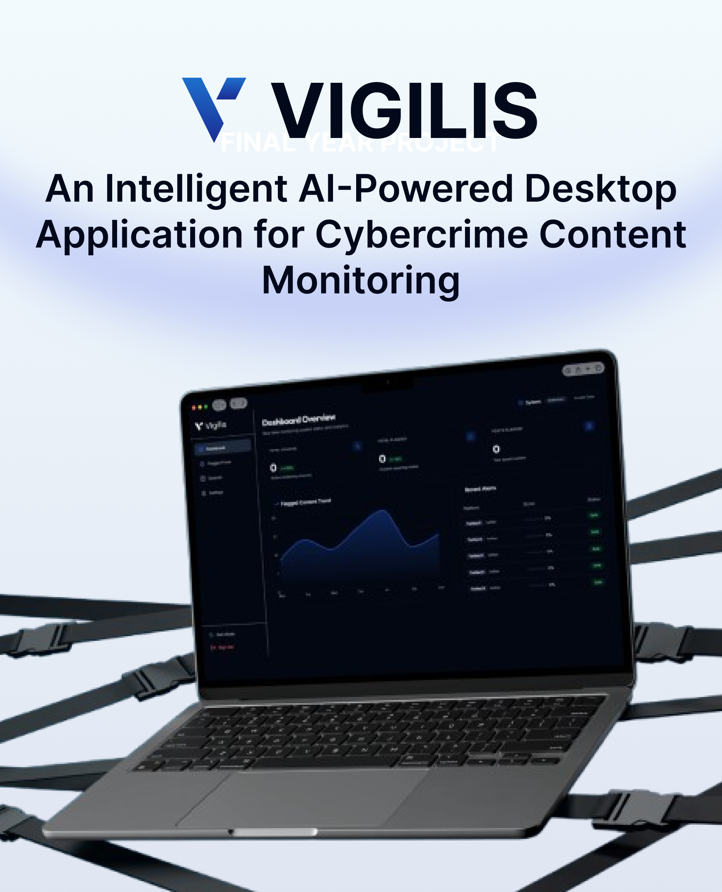
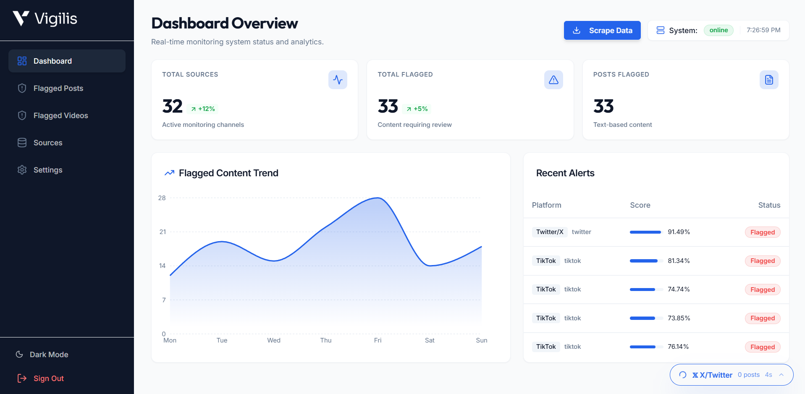
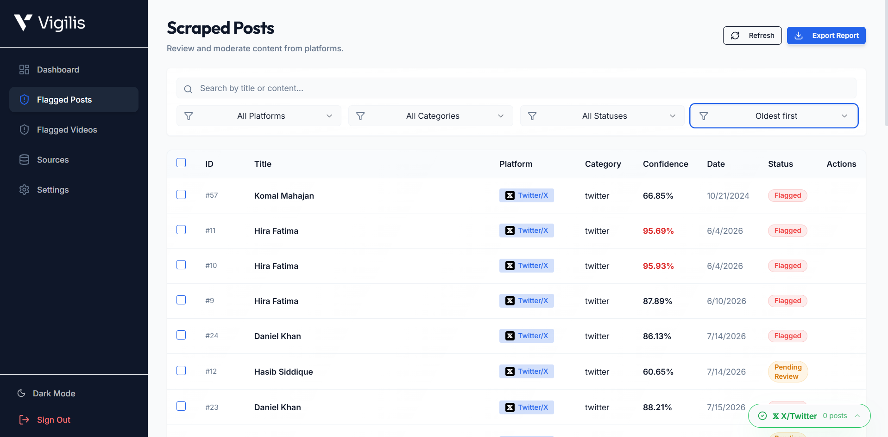

# VIGILIS
### *Monitoring the Digital World, Intelligently*

**VIGILIS** is an AI-powered, local-first desktop application for **cybercrime content monitoring**. It automates the collection, detection, and analysis of harmful online content from publicly available sources, enabling investigators to identify misinformation, hate speech, scams, extremist content, and other digital threats through intelligent multimodal AI.

Designed for Pakistan's digital ecosystem, VIGILIS combines automated web scraping, multilingual AI analysis, and investigator-focused dashboards to transform large volumes of unstructured online data into actionable investigative intelligence.

---

## Dashboard Preview

<p align="center">
  
</p>

<p align="center">
  
  
</p>

---

# Features

- 🤖 AI-powered multimodal content analysis
- 🌐 Automated scraping from X, Facebook, TikTok, and websites/blogs
- 📊 Real-time monitoring dashboard with analytics
- 🚩 Intelligent detection of hate speech, misinformation, scams, and extremist content
- 📝 AI confidence scoring and unified risk assessment
- 📁 Evidence export in PDF and CSV formats
- 🔍 Original source verification with one-click access
- 🌍 Multilingual support (English, Urdu & Roman Urdu)
- 🔒 Local-first architecture for secure investigations
- ➕ Easily extensible website scraper generation

---

# System Architecture

VIGILIS consists of four major components:

- **Desktop Application** (Electron + React)
- **FastAPI Backend**
- **Scraping Engine**
- **AI Analysis Pipeline**

The system continuously collects publicly available online content, processes it using Natural Language Processing and multimodal AI models, assigns confidence scores, and presents organized investigative evidence through an intuitive desktop interface.

---

# 💻 Technology Stack

| Area | Technology |
|------|------------|
| Desktop UI | Electron, React 19, TypeScript, Vite, Tailwind CSS, Radix UI |
| Backend | Python, FastAPI, Uvicorn, Pydantic |
| Database | PostgreSQL, SQLAlchemy, Alembic |
| Scraping | Playwright, Selenium, BeautifulSoup, Requests, yt-dlp |
| AI & Media Analysis | PyTorch, Transformers, Whisper, OpenCV, EasyOCR, librosa |

---

# Prerequisites

- Windows, macOS, or Linux
- Python 3.11
- Node.js 22 LTS+
- PostgreSQL 15+
- FFmpeg (available in PATH)

For browser-based scrapers, install Playwright browser binaries.

---

## Project Structure

```text
vigilis/
├── backend/                 # FastAPI API, database models, and migrations
├── frontend/                # Electron desktop shell
│   └── renderer/            # React/Vite user interface
├── scrapers/scrapper/       # X, Facebook, TikTok, and website scrapers
├── ai_pipeline/             # Text, image, and video analysis pipeline
├── images/                  # README screenshots
└── .env.example             # Safe environment-variable template
```

---

# Installation

## 1. Create the Database

```sql
CREATE USER vigilis_user WITH PASSWORD 'use-a-strong-password';
CREATE DATABASE vigilis_db OWNER vigilis_user;
```

---

## 2. Configure Environment Variables

Copy:

```text
.env.example
```

to

```text
backend/.env
```

Update:

- DATABASE_URL
- JWT_SECRET

For standalone scrapers, also create:

```
scrapers/scrapper/.env
```

using the same database configuration.

---

## 3. Backend Setup

```powershell
cd backend

py -3.11 -m venv .venv

.\.venv\Scripts\Activate.ps1

pip install -r requirements.txt

alembic upgrade head
```

---

## 4. Create the Initial Admin User

After the database migration succeeds, create the local administrator account:

```powershell
python create_admin_user.py
```

The helper creates `admin` with a temporary password of `admin123`. Change this password before using the system outside local development.

---

## 5. Install Scraper Dependencies

```powershell
cd ..\scrapers\scrapper

..\..\backend\.venv\Scripts\Activate.ps1

pip install -r requirements.txt

playwright install chromium
```

---

## 6. Frontend Setup

```powershell
cd ..\..\frontend

npm install

cd renderer

npm install
```

---

# ▶️ Run the Application

### Backend

```powershell
cd backend

.\.venv\Scripts\Activate.ps1

uvicorn app.main:app --reload --host 127.0.0.1 --port 8000
```

API

```
http://localhost:8000
```

Swagger

```
http://localhost:8000/docs
```

---

### Desktop Application

```powershell
cd frontend

npm run dev
```

To create a production build:

```powershell
npm run build
```

---

# Running Scrapers

```powershell
cd scrapers\scrapper

..\..\backend\.venv\Scripts\Activate.ps1

python run_scraper.py --list

python run_scraper.py web

python run_scraper.py tiktok
```

Browser-based scrapers create local browser profiles and cookies on first use. Sign in only to accounts you are authorized to use.

---

## Verify the Setup

With the backend running, open [http://localhost:8000/docs](http://localhost:8000/docs) to confirm that the API is available. In PowerShell, you can also run:

```powershell
Invoke-WebRequest http://localhost:8000/docs
```

Confirm the following before starting a scraper:

- PostgreSQL is running and `alembic upgrade head` completed successfully.
- The API is listening on port `8000`.
- The Electron app starts with `npm run dev` from `frontend`.
- Playwright Chromium is installed with `playwright install chromium`.
- `DATABASE_URL` is set in both `backend/.env` and `scrapers/scrapper/.env` when using standalone scrapers.

## Troubleshooting

| Problem | Resolution |
| --- | --- |
| `ModuleNotFoundError` or missing Python package | Activate `backend/.venv`, then run `pip install -r requirements.txt`. |
| Database connection fails | Check that PostgreSQL is running and that `DATABASE_URL` uses the correct user, password, host, port, and database name. |
| Port 8000 is already in use | Stop the process using the port, or run Uvicorn with `--port 8001` and update any client configuration accordingly. |
| Playwright reports that Chromium is missing | From `scrapers/scrapper`, run `playwright install chromium`. |
| Electron or React module is missing | Run `npm install` in both `frontend` and `frontend/renderer`. |
| Scraper cannot access a logged-in platform | Delete the relevant local browser profile only if needed, then sign in again. Profiles and cookies must never be committed. |


## VIGILIS

**An Intelligent AI-Powered Desktop Application for Cybercrime Content Monitoring**


Submitted in partial fulfilment of the requirements for the degree of

**Bachelor of Science in Computer Science**

**2026**

---

## 📄 License

This project was developed as a Final Year Project at **DHA Suffa University** for academic and research purposes.
